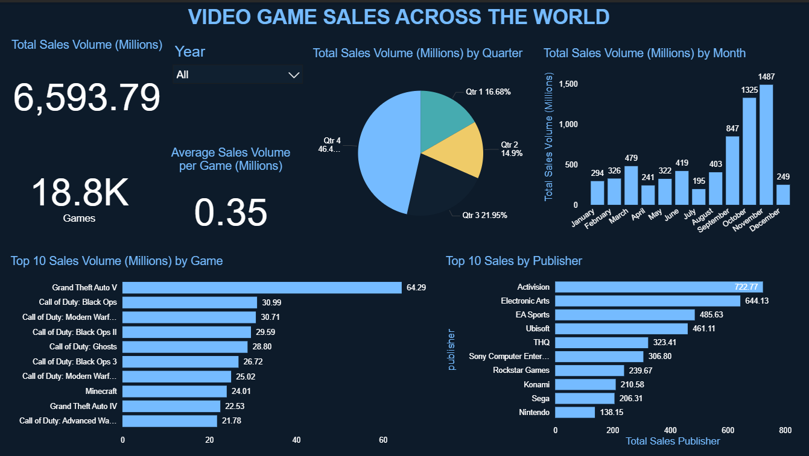
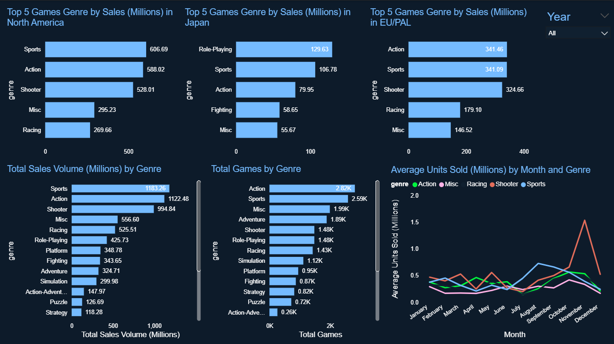
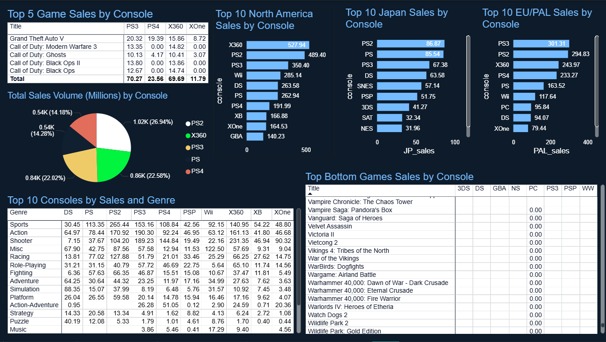

# VIDEO GAME SALES ACROSS THE WORLD
This analysis explores global video game sales from 1977 to 2020, providing insights into long-term trends in game production and consumer demand.

Over this period, 6.59 billion copies of video games were sold across 18.8 thousand titles by console, with an average of 0.35 million copies sold per game.

Sales peaked during the late third and early fourth quarters (September–November), aligning with major holiday releases and seasonal demand. However, a noticeable decline in physical game sales has been observed since 2009, reflecting the market shift toward digital distribution.

The top-performing genres — Sports, Action, Shooter, Miscellaneous, Racing, and Role-Playing — together account for 73% of total global sales (≈4.8 billion copies).

Leading publishers such as Activision, Electronic Arts, and Ubisoft dominate the market, with best-selling titles like Grand Theft Auto V and Call of Duty franchises driving exceptional sales volumes.

## 1.	Global Sales Performance

⦁	Total copies sold: 6,593.75 million (≈6.6 billion)

⦁	Average copies sold per game: 0.35 million

⦁	Games analyzed: 18,800

⦁	There’s a visible seasonal sales peak during September–November, reflecting major holiday and end-of-year releases.

⦁	The third quarter and first half of the fourth quarter consistently show the highest activity.

## 2. Best-Selling Genre and Publisher

⦁	The top six genres — Sports, Action, Shooter, Misc, Racing, and Role-Playing — together account for 4,808.28 million copies, representing 73% of total sales.

⦁	Sports (1.18B) and Action (1.12B) dominate global sales, followed closely by Shooter (995M).

⦁	Role-Playing leads in Japan, while Sports and Action dominate North America and Europe.

## 3. Regional Insights

**North America**:

⦁	Top genres: Sports (606.69M), Action (588.02M), Shooter (528.01M).

⦁	Strong preference for fast-paced and competitive games.

**Japan**:

⦁	Unique dominance of Role-Playing (129.59M), followed by Sports (106.78M) and Action (79.95M).

⦁	Reflects the influence of franchises like Final Fantasy and Pokémon.

**Europe/PAL**:

⦁	Balanced between Action (341.46M), Sports (341.09M), and Shooter (324.66M).

⦁	European players show similar tastes to North America but with stronger interest in simulation and strategy genres.

## 4. Console Performance

⦁	Top-selling consoles by total regional sales:

 	**North America**: X360 (527.94M), PS2 (489.40M), PS3 (350.40M)

 	**Japan**: PS2 (86.83M), PS (85.54M), PS3 (67.38M)

 	**Europe/PAL**: PS3 (301.31M), PS2 (294.83M), X360 (243.97M)

⦁	PlayStation consoles show consistent strength across all markets, with X360 dominating the US.
⦁ PC is the lowest-selling console.

## 5. Top Games and Publishers

### Top 5 Games (by Total Sales):

   1. **Grand Theft Auto V** – 64.29M

   2. **Call of Duty: Black Ops** – 30.99M

   3. **Call of Duty: Modern Warfare 3** – 30.71M

   4. **Call of Duty: Black Ops II** – 29.59M

   5. **Call of Duty: Ghosts** – 28.80M

### Top 5 Publishers (by Total Sales):

⦁	**Activision** – 722.77M

⦁	**Electronic Arts** – 644.13M

⦁	**EA Sports** – 485.63M

⦁	**Ubisoft** – 461.11M

⦁	**THQ** – 323.41M

These publishers lead the industry with franchises that define entire genres, particularly in Action, Shooter, and Sports.

## 6. Genre Distribution by Console

⦁	Sports and Shooter dominate on PS and X360, accounting for a significant share of their total library sales.

⦁	Action titles show strong cross-platform presence.

⦁	Racing and Misc genres provide secondary but steady performance across all platforms.

---
## 🛠️ Tools & Technologies
- **Power BI Desktop**
- **DAX (Data Analysis Expressions)**
- **Power Query**
- **Excel / CSV Data Source**
- **GitHub** for version control and project sharing

---

## 📁 Dataset
Dataset Information  
The dataset used in this project was obtained from [Maven Analytics](https://mavenanalytics.io/data-playground).  
The dataset used contains information on: 
- Title : Name of the game
- Console : Gaming platform or console
- Genre : Category or type of game
- Publisher : Company responsible for publishing the game
- Developer : Company or team that developed the game
- Critic : Professional critic ratings for the game
- NA_Sales : Sales in North America
- JP_Sales : Sales in Japan
- PAL_Sales: Sales in Europe and Oceania (PAL regions)
- Other_Sales : Sales in the rest of the world
- Release_Date : Date when the game was first released
- Last_Update: Most recent date the game information was updated

> *Note: The dataset is for educational purposes only.*

#### 📁 VIDEO GAME SALES ACROSS THE WORLD/

├── README.md                                     – Summary overview  
├── Game_Sales_Project                            – Power BI Report  
└── vgchartz-2024                                 – Sales Dataset  
  

## 👤 Author
**Dieudonné Nahimana**  
🌐 [LinkedIn Profile](https://www.linkedin.com/in/nahimana-dieudonn%C3%A9-99b4a9200/)

## 📊 Dashboard Preview

#### 🎯 Overall Sales

#### A. Sales by Genre

#### B. Sales by Console

#### C. Sales by Year and Publisher

